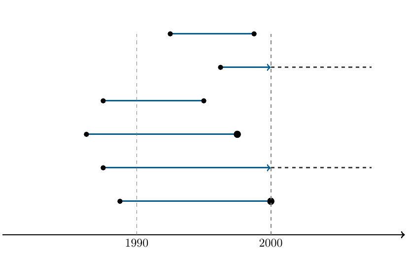
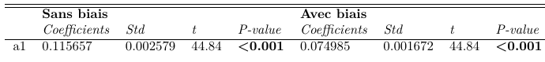
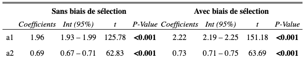
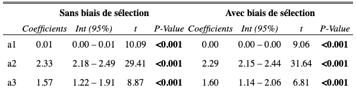

--- 
title: "Durée optimale d'un brevet"
author: "Zennaf & Léger & Akdag"
date: "`r Sys.Date()`"
site: bookdown::bookdown_site
output: bookdown::gitbook
documentclass: book
bibliography: [bibliographie.bib, packages.bib]
biblio-style: apalike
link-citations: yes
description: "Estimation de la durée de vie moyenne des brevets"
---


```{r include=FALSE}
# automatically create a bib database for R packages
knitr::write_bib(c(
  .packages(), 'bookdown', 'knitr', 'rmarkdown'
), 'packages.bib')
```

```{r setup, include=FALSE}
knitr::opts_chunk$set(echo = FALSE,warning = FALSE, out.width = '80%' , fig.align = 'center', message=FALSE)
```

```{r}
library(readxl)
library(readr)
library(dplyr)
library(GGally)
library(ggplot2)
library(kableExtra)
library(survival)
library(survminer)
library(prodlim)
library(pec)
library(ggsci)
library(dplyr)
library(survival)


library(stringr)
library(forcats)
library(maxLik)
library(fastDummies)
library(sads)
library(ggpubr)
library(sjPlot)

library(data.table)
library(DT)
library(lubridate)
library(plotly)
```

```{r}
brevet<-read_excel("base0.xls")
#brevet<-read.csv("brevets.csv", header=TRUE)
#brevet <- read_excel("C:/Users/James Bond/Google Drive/Cours (1)/3R/donnees/base0.xls")
#brevet<- read_excel("~/Google Drive/Cours/3R/donnees/base0.xls")
```

```{r}
# palette de couleurs
courbcolor <- c("#943126","#cd6155",
                "#797d7f","#99a3a4",
                "#873600","#dc7633",
                "#9c640c","#eb984e",
                "#117864","#45b39d",
                "#154360","#5499c7")

```


# Introduction

Actif sans aucune constitution physique, matérielle ou corporelle mais dont l'existence se justifie par les droits qu'il confère à son propriétaire L'actif intangible désigne tous les éléments de l'entreprise, qui participent à la réussite de celle-ci en termes de revenus, autres que ceux qui sont identifiés et qui correspondent aux équipements et autres biens matériels et monétaires. L'actif immatériel auquel on va s'intéresser est un actif relevant de la propriété industrielle : le brevet.  
	
La détention de multiples brevets par une entreprise forme un portefeuille ayant un impact économique et comptable très important pour l'entreprise le détenant. Sa gestion, étant fortement compliquée, a été la source de nombreuses études qui consistaient le plus souvent à réaliser des estimations de la valeur de l'innovation réalisée. Or, les données étant confidentielles, il est difficile de connaître la valeur d'un brevet. Pour ce faire, on peut avoir recours à différentes techniques permettant d'inférer la valeur des brevets. Dans ce rapport, nous allons évoquer différentes techniques comme l'approche financière, le modèle de renouvellement qui essaie d'inférer la valeur des brevets en utilisant les données sur le renouvellement et plus particulièrement, nous allons procéder à des estimations économétriques en prenant en compte différents biais relatifs aux données de durées afin d'approximer la durée de vie des brevets grâce à leur durée de vie. 

**Quelle est la valeur d'un brevet ? Comment peut-on inférer la valeur d'un brevet grâce à sa durée de vie ?** 
	
	
## <span style="color: #344A58;">Recherches préliminaires </span>

Le brevet est un acteur principal de l’avancement des recherches au sein des entreprises ou administrations. Il apporte un soutien majeur dans le développement des différents marchés.  

### <span style="color: #CDB380;">Quelques chiffres sur la R&D</span>
	
Comme on peut l’estimer, la recherche et développement demande un financement très important au sein des entreprises ou administrations. Afin d’apporter son soutien à la recherche, l’Etat français a investi 50 619 milliards € au niveau des différents types d’établissements. Cet investissement représente 2.2 % du PIB en 2017.

Le tableau suivant nous permet d’avoir un aperçu de la répartition des financements. 

<div style="padding:3px; border:2px dotted #fae5d3; background-color:#fae5d3;">
**Types** | **Investissements en M €**| **Part en %** |
:------: | :----------------: | :-------------: |
__Entreprises__ | __33 034__ | __65__|
*Petites et moyennes entreprises* | *5915 *| *18* |
*Entreprises de taille intermédiaire* | *7871* | *24* |
*Grandes entreprises* | *19 248* | *58* |
__Administrations__ | __17 585__ | __35__ |
**Total** | **50 619** | **100** |

<b style="color: #238694  ;">Table : Chiffres R&D </b> ^[source : Données extraites de la publication État de l'Enseignement supérieur]
</div>

Nous remarquons que 65% de ces mises en fonds sont réalisées vers les entreprises et la majorité vers les grandes entreprises c’est-à-dire les organisations ayant au moins 5 000 salariés ainsi qu’un chiffre d’affaires supérieur à 1,5 milliards € avec un total de bilan supérieur à 2 milliards € ^[définition selon l’INSEE]. 

### <span style="color: #CDB380;">Quelques classements</span>
	
Il est aussi intéressant d'étudier la position de la France concernant son investissement en R&D par rapport à d'autres pays.
Selon les données de la Banque Mondiale, la première place est détenue par l'Israël avec environ 5% de son PIB investi dans la R&D. La France se place en <b style="color: #cdaa80  ;">$12^{ème}$ rang</b> avec un investissement de 2,21% du PIB. 

La part d'investissement en recherche et développement est l'un des moteurs de l'innovation et accentue ainsi l'importance des évolutions aussi bien au niveau national qu'au niveau mondial.

Au total en 2019, <b style="color: #cdaa80  ;">14 757 demandes de dépôts de brevets</b> ont été enregistrés. 

Chaque secteur conserve une propension à breveter qui lui est propre. Nous pouvons observer une grande variabilité d'intensité de dépôt de brevet selon les secteurs. Selon l'INPI, une majorité de brevets déposés appartient à la catégorie <b style="color: #cdaa80  ;">mécanique</b> avec 5984 brevets enregistrés. La deuxième catégorie est <b style="color: #cdaa80  ;"> l'électrotechnique</b> avec 3115 demandes suivie par le domaine de la <b style="color: #cdaa80  ;"> chimie et instruments</b> avec 2143 dépôts de brevets. 
Ces catégories possèdent aussi des sous-ensembles décrits dans le tableau suivant. Cette classification se nomme la <b style="color: #cdaa80  ;"> CIB : *Classification Internationale des Brevets* </b>. Elle est composée de 5 domaines principaux et de 35 sous-domaines. Chaque brevet est donc codé selon son champ technologique d'application de l'innovation et non pas par rapport au secteur économique d'activité de l'entreprise.

D'autres aspects ont un impact sur la propension à breveter, comme le cadre légal d'un dépôt de brevet. 

## <span style="color: #344A58;">Cadre juridique de la propriété intellectuelle</span>

> <span style="color: #cdaa80  ;"> Le terme brevet désigne légalement "un droit de propriété industriel accordé par une autorité publique à celui qui révèle, décrit de façon complète et suffisante et revendique une invention, pour le faire bénéficier d’un monopole d’exploitation sur cette dernière, lui permettant de la protéger contre d’éventuelles contrefaçons mais aussi d’en percevoir les fruits, pendant un temps limité". L'invention brevetée doit être caractérisée par la nouveauté, l'inventivité et l'applicabilité.</span>
	
	
En France, le droit des brevets relève du Code de la propriété intellectuelle, plus précisément du livre VI intitulé "Protection des inventions et des connaissances techniques" qui comprend les articles L611-1 à L623-44. Le droit des brevets désigne l'ensemble des lois et décrets qui encadrent l'exclusivité d'exploitation des inventions. 
	
Dans son article intitulé "renewal fees and other patent fees in foreign countries" de 1958, Pasquale Joseph Federico, mathématicien et longtemps haut membre de l'office des brevets des \'Etats-Unis nous propose un tour d'horizon des différents systèmes légaux de protection des brevets en vigueur dans 23 pays du monde. Cet article nous montre que non seulement les frais relatifs à l'établissement et au maintien des brevets sont différents, mais le fonctionnement des systèmes nationaux sont également différents. 
	
Les organismes délivrant les brevets à l'échelle nationale sont les offices nationaux de brevet. En France, c'est l' INPI (Institut National de la Propriété Industrielle)  qui délivre les brevets. À l'échelle européenne, il convient de s'adresser à l'OEB (Office Européen des Brevets) afin de déposer une demande internationale de brevet. À l'échelle mondiale, c'est l'OMPI (Organisme Mondial de la Propriété Intellectuelle) qui relève des Nations unies et qui a pour rôle de favoriser l'innovation et la créativité. Il est donc également possible de déposer une demande de brevet internationale grâce au PCT (Patent Cooperation Treaty) et le brevet en découlant sera donc valable dans les pays signataires de ce traité. 


> <span style="color: #cdaa80  ;">Le cadre légal de la propriété industrielle a une influence sur les dépôts de brevets. En effet, l'inventeur susceptible de déposer un brevet réalise un arbitrage entre les bénéfices et les coûts (monétaires ou non) qui découlent de ce dépôt.</span>


# Mieux comprendre les brevets

Dans cette partie, nous allons nous intéresser à la valeur des brevets, plus précisément à leur valeur économique et stratégique. On commencera par s'intéresser aux déterminants de la décision de breveter, cette décision dépend notamment des obligations légales et de la valeur des brevets. Justement, la partie suivante nous présentera quelques méthodes utilisées par les entreprises pour évaluer leurs brevets en termes monétaires. On terminera par parler des rôles potentiels des brevets. 

## <span style="color: #344A58;">Breveter ou pas</span>

Un inventeur est toujours confronté à un arbitrage entre breveter son invention ou la garder secrète. Le choix qui sera fait dépendra de plusieurs éléments : 

* la taille et le secteur d'activité de l'entreprise, 

* le degré d'innovation du produit c'est-à-dire si il correspond à une simple amélioration ou à une innovation radicale, 

* la typologie de l'invention (produit ou procédé), 

* son influence sur le marché, 

* son origine dans l'entreprise...

Plus basiquement, l'inventeur va <b style="color: #cdaa80;"> comparer ses gains et ses coûts</b> et choisir la stratégie la plus avantageuse. Les coûts à prendre en compte sont, entre autres, d'ordre administratif et financier. 
	
### <span style="color: #cdb280;">Les coûts administratifs</span>
	
Les formalités relatives à une demande de brevet regroupent <b style="color: #cdaa80  ;"> l'ensemble des tâches administratives dont la réalisation est nécessaire pour déposer un brevet</b>. La procédure de dépôt de brevet comprend 4 étapes : dépôt du dossier (36€ pour dix revendications ou moins), examen du dossier et réponse (520€), publication du brevet, délivrance du brevet (90€). Éventuellement, si le nombre de revendications excède 10 alors chaque demande supplémentaire aura un coût de 42€.

Il est très important de noter que lorsque l'on souhaite déposer une invention dans un pays particulier, il convient de s'adresser à l'organisme compétent dans ce même pays. Si on souhaite protéger son invention dans plusieurs pays, alors il faut s'adresser à chaque organisme national de manière indépendante. Le fait de devoir déposer plusieurs demandes a un effet dissuasif du fait d'importants frais administratifs (entre autres des frais juridiques et de traduction). Ceci étant dit, à l'échelle européenne, il est possible de breveter une invention dans plusieurs pays avec une seule demande. Dans ce cas, il faut s'adresser à l'Office Européen des Brevets (OEB). Cependant, il existe des limites à ces procédures européennes. En effet, la réglementation impose la traduction du descriptif de l'invention dans toutes les langues des pays concernés par ce dépôt international de brevet. Evidemment, cela entraîne des coûts de traduction énormes qui sont très dissuasifs pour le demandeur de brevet. Volontairement ou involontairement, ce sont uniquement les innovations très importantes (i.e. générant d'importants bénéfices) qui sont brevetées par l'OEB. 
	
	
### <span style="color: #cdb280;">Les coûts financiers</span>

	
Les systèmes de protection des inventions impliquent tous la redevance de frais relatifs au maintien du droit de propriété industriel. En général, ces frais sont dûs chaque année et sont appelés <b style="color: #cdaa80  ;">"annuités"</b> (taxe progressive pour le maintien du brevet). Pour cela, il sera nécessaire de régulariser tous les ans auprès de l'institut cette taxe qui vaut 38€ la première année et 790€ la $20^{ème}$ année.
	
	
```{r}

france<-c(0, 38, 38, 38, 38, 76, 96, 136, 180, 220, 260, 300, 350, 400, 460, 520, 580, 650, 730, 800)
allemagne<-c(0, 0, 70, 70, 90, 130, 180, 240, 290, 350, 470, 620, 760, 910, 1060, 1230, 1419, 1590, 1760, 1940)
seq<-seq(1, 20, 1)
dt_annuite<-data.frame(cbind(seq, france, allemagne))
```

```{r}
library(ggplot2)
ggplot(data = dt_annuite, aes(x = seq, y = france)) +
  geom_line(color="#238694") +
  geom_line(aes(x = seq, y = allemagne), color="#344a58") + 
  labs(y = "Montant des annuités",
      x = "Age du brevet",
     title = "Annuités en France et en Allemagne") +
  theme_minimal()+theme(plot.title =element_text(size=10)) + 
  annotate(geom="text", x=17, y=1750, label="Allemagne",
            color="#344a58")+ 
  annotate(geom="text", x=17, y=800, label="France",
              color="#238694")
```

Les frais de renouvellement sont généralement croissants ce qui influence négativement la durée de vie des brevets.  P.J. Federico dans son article intitulé _Renewal Fees and Other Patent Fees in Foreign Countries_ [^n1] paru en 1958 @Frederico ,  utilisait déjà l'expression "cutting out the dead wood". Le nombre de brevets maintenus est donc décroissant avec l'âge et avec les frais de renouvellement. On observe que la plus grande partie des brevets abandonnés le sont au cours des dix premières années de la vie d'un brevet.
	
> <span style="color: #cdaa80  ;">La décision de breveter doit donc être fonction des coûts liés au dépôt et au maintien du brevet et de la valeur du brevet. Nous allons donc nous pencher sur quelques méthodes utilisées par les entreprises pour évaluer la valeur de leur portefeuille de brevets.</span>


## <span style="color: #344A58;">Approche financière</span>

De nombreux travaux sont le fruit des recherches d’économistes qui ont eu besoin d’évaluer la valeur d’un brevet pour leurs recherches en mettant en exergue des variables fortement corrélés avec la valeur d’un brevet. Ici, il s’agit de méthodes d’évaluations utilisées par les praticiens.

<b style="color: #cdaa80;">Méthodes d'évaluation des droits de la propriété intellectuelle</b>

Les méthodes d’évaluation de la valeur des droits de la propriété intellectuelle sont de trois types : les évaluations fondées sur les coûts, sur les prévisions de revenus et sur la valeur du marché. 

- <b style="color: #cdaa80;">Evaluation fondée sur les coûts</b>

	Cette méthode d’évaluation correspond plus à une approche comptable que financière. La méthode la plus utilisée est celle des coûts historiques. 
	Cette méthode va supposer que la valeur d’un brevet n’est rien d’autre que les dépenses engagées pour le mettre au point, à savoir : les coûts en recherche et développement, les coûts de matériels, les frais financiers, les frais administratifs, les coûts liés aux dépôts,… . 
	Elle est la méthode la plus habituellement utilisée à des fins comptables. 
	
	Cette méthode est souvent considérée comme une méthode simple du fait de la simplicité d’accès aux informations qu’elle utilise et la plus objective dans la mesure où elle est basée sur des données financières connues. Cependant, une des limites de cette méthode est l’absence de corrélation entre les dépenses pour un actif et sa valeur réelle. 
	
- <b style="color: #cdaa80;">Evaluation fondée sur les revenus</b>
	
	Concernant l’évaluation basée sur les prévisions de revenus, elle correspond à une évaluation financière. Elle repose sur une projection des recettes attendues de l’exploitation du brevet. Cette méthode se base sur des éléments et données souvent évalués en amont par l’entreprise. On peut citer deux méthodes couramment utilisées pour évaluer la valeur des brevets : affectation d’une quote-part du bénéfice net au brevet et calcul des redevances espérées et actualisation des flux.
		
	Concernant la seconde méthode, c’est le montant de ces redevances actualisées qui vont constituer la valeur du brevet. Cette méthode présente différents inconvénients. La détermination du taux d’actualisation qui est basée sur des suppositions où alors sur des modèles statistiques assez complexes. Un autre inconvénient est que la valeur des redevances perçues va être nettement inférieure à la valeur stratégique que confère le brevet. Dans ce cas, les redevances actualisées ne reflètent donc pas la valeur réelle du brevet.
	
- <b style="color: #cdaa80;">Evaluation fondée sur la valeur du marché</b>
	
	Concernant la dernière méthode d’évaluation, fondée sur la valeur du marché, il s’agit là de s’appuyer sur des transactions connues sur des technologies ou actifs similaires (cessions de brevets ou de licences). La méthode utilisée est la méthode des comparables. A travers cette méthode, on suppose que la valeur du brevet équivaut au prix payé sur le marché pour obtenir un actif similaire.
	Cela peut s’avérer difficile car chaque brevet est spécifique et sa valeur peut varier en fonction du contexte dans lequel ils sont employés (entreprise ayant déjà un portefeuille de brevets ou d’autres actifs complémentaires pourra accorder une valeur bien plus importante à un brevet que son concurrent). Aussi, des difficultés surviennent lorsque le marché est récent où les références sont peu nombreuses.
	
	
## <span style="color: #344A58;">Rôle d'un brevet</span>

Le brevet étant le fruit de l’innovation il peut aussi en être son moteur. Cela consiste à accumuler des brevets non plus uniquement à des fins d’exploitation (qu’elles soient internes ou externes) mais à leur attribuer de nouveaux rôles. 

Parmi ces rôles on notera notamment :

- <b style="color: #cdaa80;">un rôle de signal</b>: dans le but de signaler le niveau de performance de l’entreprise,  de ses compétences technologiques. Le brevet va avoir un rôle sur la réputation de la firme vis-à-vis des différentes personnes avec qui elle travaille : ses concurrents, clients ou fournisseurs mais aussi vis à vis de ses partenaires potentiels ou investisseurs
		
- <b style="color: #cdaa80;">un rôle de négociation</b> : le brevet est bien un outil qui sert de « monnaie d’échange » dont on souhaite bien entendu augmenter la valeur. Il permet ainsi au détenteur de conserver la liberté d’exploitation de ses propres technologies, mais aussi d’accéder aux technologies développées par d’autres
		
- <b style="color: #cdaa80;">un rôle juridique</b> : certaines firmes utilisent la propriété intellectuelle pour saisir des contrefacteurs potentiels et non pour mettre en œuvre des innovations
		
- <b style="color: #cdaa80;">un rôle de veille technologique</b> : le détenteur doit expliciter les caractéristiques de l’invention lors du dépôt de la demande. L’exploitation des bases de données de brevets fournit donc une source importante d’informations qui peuvent être notamment utilisées pour rechercher de futurs partenaires, orienter l’activité inventive ou encore repérer les principaux concurrents en R\&D et les contrefacteurs potentiels
		
- <b style="color: #cdaa80;">un rôle incitatif</b> : Il peut inciter les salariés à être créatifs, les pousser à formaliser leurs idées qui par la suite pourront obtenir des primes et récompenses associées au dépôt de ce brevet. Il peut être vu comme un outil de motivation dans l’entreprise
		
- <b style="color: #cdaa80;">un rôle de blocage</b> : jusqu’aux années 80 les firmes brevettaient avant tout des innovations ayant une importance pour leurs activités et donc qu’elles souhaitaient directement valoriser. Dans les années plus récentes, les entreprises déposent de plus en plus de brevets ayant peu d’importance autour de l’invention de base pour renforcer le pouvoir du brevet central. Elles procèdent ainsi à la formation de portefeuilles de brevets qui créent autant de blocage
		

Les rôles cités ci-dessus sont tout aussi importants que la volonté d’empêcher l’imitation. 
Il paraît assez compliqué d’évaluer les retombées du brevet en tant qu’outil de motivation et de création. Cependant, il semble possible d’évaluer les deux derniers rôles à savoir l’accès aux technologies des entreprises du même secteur ainsi que son rôle contre le risque juridique. 
	
	
La protection engendrée par le dépôt de brevet est un <b style="color: #cdaa80;">avantage stratégique</b> pour la firme mais aussi un conducteur d'information. Lors du dépôt de demande de brevet, une divulgation d'information est causée. Cette action peut être réalisée pour une multitude de raisons. 

La première est l'empêchement de <b style="color: #cdaa80;">la copie</b> ou <b style="color: #cdaa80;">l'imitation</b> comme par exemple, dans le secteur pharmaceutique. La demande doit être faite très rapidement car le produit sera facile à imiter après une analyse des premiers articles vendus. 
La réalisation du dépôt peut aussi avoir une motivation essentielle de maximiser les flux de redevances résultant de la vente de licences et donc d'acquérir des <b style="color: #cdaa80;">avantages commerciaux</b>. Nous remarquons que par le biais de la divulgation d'informations, une forte <b style="color: #cdaa80;">incitation à innover</b> peut voir le jour. Ceci est l'un des <b style="color: #cdaa80;">déterminants de la croissance endogène</b>. Ainsi, les gains d'avantages commerciaux rapportent une position de leader sur la courbe d'expérience qui aura un impact majeur sur les efforts marketing et vente. 

## <span style="color: #344A58;">Durée optimale légale</span>

Le terme maximal légal d'un brevet est donc le fruit d'un <b style="color: #cdaa80  ;">arbitrage</b>. Quelques exemples sont consultables dans le tableau ci-dessous. 
	
```{r}
library(kableExtra)
pays<-c("Australie", "Belgique", "Brésil", "Canada", "Chine", "France", "Allemagne", "Italie", "Turquie", "Etats-Unis")
terme<-c( "16 ans", "20 ans", "15 ans", "20 ans", "20 ans", "20 ans", "20 ans", "20 ans", '5, 10 ou 15 ans', "20 ans")
kable_styling(kable(rbind(pays, terme), format = "html", ), font_size = 9)
```

	
Ce terme maximal d'un brevet influence-t-il réellement la valeur d'un brevet ? Théoriquement, c'est le cas car plus le terme est long, plus les bénéfices actualisés découlant d'un brevet sont importants. Dans les faits, c'est autre chose car seule une petite fraction de brevet reste en vigueur jusqu'au terme maximal comme le montre le graphique suivant tiré de l'article de P.J. Federico sur la période 1930-1939.
	

```{r}
gb<-c(100, 100, 100, 100, 100, 59.9, 46.7, 37.7, 30.8, 25.1, 20.4, 16.2, 13.1, 10.7, 8.6, 6.9, 5, 0 , 0, 0)
allemagne<-c(100, 100, 100, 94.6, 90.1, 80.8, 73.3, 56.2, 47, 37.3, 29.6, 22.8, 18, 13.9, 11.1, 8.5, 7, 5.7, 4.5, 2.2)
suisse<-c(100, 87.4, 72.2, 56.8, 44.8, 35.8, 28.7, 23, 18.8, 15.1, 12.1, 9.7, 7.9, 5.7, 4.2, 0, 0, 0, 0, 0)
seq<-seq(1, 20, 1)
dt_abandon<-data.frame(cbind(seq, gb, allemagne, suisse))
```

```{r}
library(ggplot2)
ggplot(data = dt_abandon, aes(x = seq, y = suisse)) +
  geom_line(color="#238694") +
  geom_line(aes(x = seq, y = allemagne), color="#344a58") + 
  geom_line(aes(x = seq, y = gb), color="#cdb280") + 
  labs(y = "Taux de brevets maintenus",
       x = "Age du brevet",
       title = "Taux de brevets maintenus en Allemagne, Grande-Bretagne, et Suisse") +
  theme_minimal()+theme(plot.title =element_text(size=10)) + 
  annotate(geom="text", x=11, y=50, label="Allemagne",
              color="#344a58")+ 
  annotate(geom="text", x=2.5, y=60, label="Suisse",
              color="#238694")+ 
  annotate(geom="text", x=5, y=75, label="GB",
              color="#cdb280")
```

	
> <span style="color: #cdaa80  ;">La plus grande partie des brevets est donc abandonnée avant le terme imposé par l'Etat. Cette durée de vie maximale semble donc à priori ne pas avoir d'influence directe sur la valeur d'un brevet ou sur sa durée de maintien en vigueur mais semble en avoir sur l'espérance de sa valeur.</span>

## <span style="color: #344A58;">Incitation à l'innovation VS bien-être social</span>

<b style="color: #cdaa80;">Droit de la concurrence et de la propriété intellectuelle</b>

Les droits de la propriété intellectuelle et de la concurrence se complètent. A première vue, les gens ont tendance à considérer que le droit de la concurrence combat les monopoles alors que le droit de la propriété intellectuelle en crée.

Cependant, le droit de la concurrence ne punit pas les monopoles en tant que tel mais l’abus de monopole. En effet, les entreprises qui se construisent une position de monopole par le mérite, grâce par exemple à de bons investissements en R\&D, ne sont pas condamnées, car sinon il n’y aurait plus d’innovation. De son côté, le droit de la propriété intellectuelle n’octroie pas un monopole, mais une exclusivité sur une invention qui ne se traduit pas forcément par une situation de monopole sur un marché. Un brevet ne dit rien sur les techniques qui peuvent se substituer à celles protégées.

Les économistes américains mettent l’accent sur le caractère incitatif du droit de la propriété intellectuelle avec l’idée que l’invention se matérialise par de la production d’information, un bien non excluable. Le mécanisme juridique mis en place par le droit de la propriété intellectuelle rend le bien excluable. Quant au droit de la concurrence, il contribue indirectement à l’innovation en faisant en sorte que le marché reste ouvert.

<b style="color: #cdaa80;">Brevets et distorsions liées au monopole</b>

Il existe un lien étroit entre les droits de brevet et la concurrence. 
D’un côté, les législations relatives aux brevets visent à empêcher la copie ou l’imitation de produits brevetés et complètent ainsi les politiques de concurrence en favorisant un comportement équilibré du marché. 
Un équilibre doit donc être trouvé entre la politique relative à la concurrence et les droits de brevet. Cet équilibre doit permettre d’empêcher les abus de droits de brevet, sans annuler les avantages prévus par le système des brevets lorsque ces droits sont utilisés de façon appropriés. 
	
De manière générale, le brevet permet de protéger son inventeur de l’imitation. Par la même occasion, il procure à l’entreprise le droit exclusif de produire un bien. Le brevet accorde donc une place de monopole au détenteur ce qui entraîne des distorsions de marché. 
	
Le brevet implique un prix plus élevé et une quantité échangée sur le marché moins importante. Cela entraîne donc une diminution du surplus social, une perte de bien-être au niveau de toute la société. Après l’expiration du brevet, on a un retour à l’équilibre concurrentiel. 
	
Toute cette première partie nous éclaire sur les brevets, en particulier sur leur valorisation au sein des entreprises et sur les déterminants de leur durée de maintien en vigueur. Pour revenir à notre problématique globale, tous ces éléments nous aident à prendre conscience des multiples déterminants de la durée de vie des brevets. En plus de cette complexité au niveau stratégique, il faut noter que les données de durées ne sont pas exploitables de la même manière que les données classiques. Il existe des particularités que l'on devra prendre en compte pour répondre à notre problématique. Nous allons donc présenter les modèles de durées qui seront utilisés ultérieurement pour faire des estimations de la durée de vie moyenne des brevets.

[^n1]: Pasquale Joseph Federico, mathématicien et longtemps haut membre de l’office des brevets des États-Unis nous propose un tour d’horizon des différents systèmes légaux de protection des brevets en vigueur dans 23 pays du monde. Cet article nous montre que non seulement les frais relatifs à l’établissement et au maintien des brevets sont différents, mais le fonctionnement des systèmes nationaux sont également différents. 

# Mieux comprendre les modèles de durée

```{r}
#creation des variables dummies
brevet$cat_e0d1 <- ifelse(brevet$e==0 | brevet$d==1, 0,1)
brevet$cat_e0d0 <- ifelse(brevet$e==0 | brevet$d==0, 0,1)
brevet$cat_e1d1 <- ifelse(brevet$e==1 | brevet$d==1, 0,1)
brevet$cat_e1d0 <- ifelse(brevet$e==1 | brevet$d==0, 0,1)
#base0$I20_e1d1 <- ifelse(age == 20 |e==1 | d==1,0,1)
#base0$I20_e1d0 <- ifelse(age == 20 |e==1 | d==0,0,1)
brevet$I20 <- ifelse(brevet$age == 20,0,1)
```

```{r}
#brevet$censure[brevet$af == "0"]<- 1
#brevet$censure[brevet$af != "0"]<- 0
#table(brevet$censure)
brevet$censure <- case_when(
  brevet$af == 0 ~ "1",
  brevet$af != 0 ~ "0"
)
brevet$censure <- as.numeric(brevet$censure)
```

```{r}
#suppression des doublons (suppression de 95 obs)
brevet<- brevet %>% filter(!duplicated(Num))
```

```{r}
brevet_filtrer <- filter(brevet, statut == "ACT")

```


## <span style="color: #344A58;">Description des données</span>

Le base de données que nous avons à disposition contient des informations sur 3710 brevets actifs entre 1990 et 2000. Cette base de données a été constituée à partir du stock de brevets actifs en 1990 et est exhaustive pour tous les brevets déposés entre 1990 et 2000. 

Les informations a notre disposition sont les suivantes :

- <b style="color: #cdaa80;">le numéro de dossier du brevet</b> 
- <b style="color: #cdaa80;">la date de dépôt</b>
- <b style="color: #cdaa80;">la date de dernière nouvelle (date d'abandon ou non)</b>

- <b style="color: #cdaa80;">le statut du brevet</b> :

<div style="padding:3px; border:2px dotted #fae5d3; background-color:#fae5d3;">
| Statut | Nb de brevets | Pourcentage |
|:-----------:|:-------------:|:-------------|
| EXP : expiré | 125 | 3,3 |
| ABD : abandonné | 2016| 54,3|
| CEDE : cédé | 16 | 0,4|
| ACT : actif | 1553 | 41,8|
</div>

- <b style="color: #cdaa80;">la direction opérationnelle à laquelle appartient le brevet</b>
<div style="padding:3px; border:2px dotted #fae5d3; background-color:#fae5d3;">
| Directions | Nb de brevets | Pourcentage |
|:-----------:|:-------------:|:-------------|
|DAM  | 525 | 14,15 |
|DCC  | 518 | 14,1 |
|DSV | 109 | 2,9|
|DRN |327  | 8,8|
|DTA |1530 | 41,2|
|INSTN |2 | 0,05|
|IPSN | 1,9|
|DG |10| 0,3|
|autre (non classé)|408| 11|
</div>

Notre but compte tenu des informations à notre disposition est de pouvoir estimer la durée de vie des brevets et ainsi avoir des renseignements sur leur valeur. 
Nous avons ici à faire avec des données de durées. Ce type de données présente des spécificités du fait que l’on étudie une caractéristique acquise au cours du temps : il faudra situer les événements dans le temps et non pas simplement regarder si le brevet a été abandonné ou non durant la période de l’observation. Les études de survie sont un type d’étude utilisant des méthodes d’analyses particulières. Ces méthodes vont permettre d’étudier le délai de survenue d’un événement. Dans notre cas, l’objectif va être de déterminer à quel âge un brevet arrêtera d’être renouvelé.

Avant de procéder aux estimations, nous allons nous intéresser aux spécificités de notre base de données. Nous allons nous intéresser à la collecte des données afin d’identifier les éventuels "problèmes" d’échantillonnage et de manque d’information. Tous ces renseignements seront utiles afin de pouvoir correctement construire notre modèle statistique de durée de vie et obtenir les meilleures estimations possibles.

<b style="color: #cdaa80;">Echantillonnage de la BDD : données tronquées</b>

Notre base de données contient tous les brevets devenus actifs entre 1990 et 2000. De plus, de par l'échantillonnage de stock, elle contient tous les brevets actifs en 1990. Ces derniers ont donc été déposés entre 1970 et 1989 car on rappelle que la durée maximale légale d'un brevet est de 20 ans. Tous les brevets déposés et abandonnés avant 1989 ne sont pas présents dans la base de données. Seuls les brevets déposés avant 1989 et toujours actifs en 1990 sont recensés. On est donc dans une situation de troncature car tous les brevets non renouvelés jusqu'en 1989 ne sont pas recensés. On a donc dans ce cas, une surestimation des durées de vie car les brevets présents ont tendance à être des brevets longs.

Pour ce faire, notre devons prendre en compte cet effet de biais d'échantillonnage sur le stock initial au moment de nos estimations pour les brevets ayant été déposés avant 1990 afin de ne pas biaiser nos résultats. 

<b style="color: #cdaa80;">Informations incomplètes de la BDD : données censurées</b>

L'information est incomplète pour certains brevets. En effet, à l'année 2000 (date de fin de l'étude), certains des brevets sont toujours actifs. Pour ceux là, nous n'avons toujours pas observé l'évènement d'intérêt qui correspond à l'abandon du brevet. Dans ces cas là la durée observée entre la date de dépôt et l'année de fin de suivi n'est pas appelée durée de vie du brevet mais l'on parle plutôt d'une ancienneté. En effet, comme l'on ne connaît pas la date d'abandon du brevet, on parle d'une ancienneté (ancienneté qui est plus courte que la durée de vie totale). Nous sommes dans le cas de brevets censurés à droite.

Pour ce faire, pour les brevets abandonnés après 2000, nous devons prendre en compte cette censure à droite pour faire nos estimations. 


De plus, on observe un deuxième cas de censure à droite lié au fait que la durée de vie des brevets est contrainte à 20 ans. Les brevets ayant atteint la durée maximale légale devront eux aussi être traités différemment.

Après avoir recensé les différentes situations présentes dans la base de données, nous allons représenter ces cas et voir quelle est la proportion de brevets se trouvant dans ces différents cas.

<b style="color: #cdaa80;">Synthèse des cas de la BDD</b>

Nous allons tout d'abord commencer par une représentation graphique des cas afin de mieux fixer les idées. 
<div align="center">

{width=550}

</div>

<div style="padding:1px; border:0.5px dotted #fae5d3; background-color:#fae5d3;">
| **Cas** |  **Durée de vie** | **Effectifs** | **Part en %**|
|---------------------------:|:-----:|:----:|:----|
|Brevets déposés après 1990 et abandonnés avant 2000 | connue |	570	| 12,9 |
|Brevets déposés après 1990 et abandonnés après 2000| inconnue (ancienneté) | 1262 |	35.6 |
|Brevets déposés avant 1990 et abandonnés avant 2000 |connue |	1441 | 42,3 |
|Brevets déposés avant 1990 qui ont atteint l'âge maximal légal avant 2000 | maximale	| 117 |	3 |
|Brevets déposés avant 1990 et abandonnés après 2000|inconnue (ancienneté)|	201	| 6,2 |
|Brevets déposés avant 1990 qui ont atteints l'âge maximal légal en 2000 | maximale| 8 |	3 |


<b style="color: #238694  ;">Table :  Effectifs et parts des brevets</b> ^[source : Base de données du projet 3R]
</div>

&nbsp;

Une fois les différents problèmes identifiés nous allons pouvoir passer aux estimations. Pour ce faire, nous allons faire : 
- une estimation semi paramétrique à l'aide du package *survival*
- une estimation non paramétrique à l'aide du package *survival*
- une estimation paramétrique en construisant la vraisemblance "à la main" afin de prendre en compte les spécificités de notre jeu de données. La log-vraisemblance sera par la suite maximisée grâce au package *maxLik*


## <span style="color: #344A58;">Fonctions utiles</span>

### <span style="color: #cdb280;">Fonction de survie</span>


La fonction de survie est, pour $t$ fixé, la probabilité de survivre jusqu'à l'instant $t$, c'est-à-dire :
	

$$	S(t) = \mathbb{P}(\mathbb{X} > t), t \geqslant 0 $$

### <span style="color: #cdb280;">Fonction de répartition </span>
  
La fonction de répartition(ou c.d.f pour "cumulative distribution function" ou courbe cumulée des évènements en fonction du temps) représente, pour $t$ fixé,la probabilité de mourir avant l'instant $t$,c'est-à-dire
	
 
$$F(t) = \mathbb{P}(\mathbb{X} \leqslant t) = 1 - S(t)$$

	
Remarque : le signe d'inégalité stricte ou pas n'a aucune importance quand la loi $\mathbb{X}$ est continue mais lorsque l'on a des sauts (temps discret) il est donc important de faire la précision inférieure ou égale.


### <span style="color: #cdb280;">Risque instantané $\lambda$ ou taux de hasard :</span>
	
Le risque instantané ou taux d'incidence, pour $t$ fixé caractérise la probabilité de mourir dans un petit intervalle de temps après $t$, conditionnellement au fait d'avoir survécu jusqu'au temps $t$ c'est-à-dire le risque de mort instantané pour ceux qui ont survécu :
	

$$	\lambda(t) = \frac{f(t)}{S(t)} = ln(S(t))^{'}$$

<span style="color: #cdaa80;">Taux de hasard cumulé $\varLambda$</span> correspond à l'intégrale du risque instantané $\lambda$:
	

$$	\varLambda(t) = \int_{0}^{t} \lambda(u)du = -ln(S(t))$$
	
On peut en déduire de cette expression l'équation de la fonction de survie en fonction du taux de hasard cumulé (ou risque instantané) : 
	

$$	S(t) = exp(-\varLambda(t)) = exp(-\int_{0}^{t} \lambda(u)du)$$
	
Ce qui donne 
	

$$	f(t) = \lambda(t)exp(-\int_{0}^{t} \lambda(u)du)$$
	
	
### <span style="color: #cdb280;">Moyenne, variance et quantile de la durée de vie: </span>

- Temps moyen de survie $\mathbb{E}= \int_{0}^{\inf} S(t)dt$
- Variance de la durée de survie $\mathbb{V}(X) = 2\int_{0}^{\inf} tS(t)dt - (\mathbb{E(X)})^{2}$
- Fonction quantile de la durée de survie $q(p) = F^{-1}(p) = S^{1}(1-p), 0 < p < 1$, le quantile $q(p)$ est le temps où une proportion $p$ de la population a disparu.


## <span style="color: #344a58;">Estimation semi-paramétrique</span>

### <span style="color: #cdb380;">Modèle de hasards proportionnels</span>
	
L'objectif principal est d'évaluer l'effet de covariables sur la durée de vie.

Comme il y a des facteurs X de types binaires, qualitatifs ou quantitatifs et éventuellement des facteurs ayant la notion d'âge, alors il serait intéressant de mettre en place un raisonnement valable en multivarié qui nous permettrait d'obtenir des rapports de risques instantanés (Hazard ratio).
	
Modèle générale :
	

$$	\lambda(t | Z) = \lambda_{0}(t)h(\beta,Z)$$

Avec :

  - Z : vecteur de covariables
  - $\beta$ : paramètre d'intérêt
  - h : fonction positive

Idée de Cox :

  - Estimer la fonction $h(t)$ sur l'échantillon
  - Vérifier l'existence d'un risque proportionnelle c'est-à-dire quels que soient deux individus $i$ et $j$ qui ont pour covariables $Z_i$ et $Z_j$ ; le rapport des fonctions de hasard ne varie pas au cours du temps
  - Chercher à estimer le hazard ratio, soit le coefficient multiplicateur de $h(t)$

	
	
### <span style="color: #cdb280;">Modèle de @Cox </span>
	
Un cas particulier très important est le modèle de Cox, qui suppose que la fonction $h$ est la fonction exponentielle, c'est-à-dire,

$$\lambda(t | Z) = \lambda_{0}(t) exp(\beta^{'},Z)$$
	
L'estimation du coefficient de régression de $\beta$ se ferait à l'aide d'une technique de vraisemblance partielle de Cox c'est-à-dire que les estimations se feront conditionnellement à l'ensemble des instants où un décès a lieu.


#### Modélisation

Nous allons réaliser l'estimation des coefficients selon le modèle de Cox en régressant la fonction de survie selon les différents domaines d'exploitation des brevets au sein de l'entreprise. 

Le résumé de cette regression est comme suit :

```{r}
ft_survie<-Surv(brevet$age,brevet$d)
cox_final <- coxph(ft_survie ~ do  ,data = brevet,x=TRUE,y=TRUE)
cox_final
```

Suite à cette estimation, nous obtenons le tableau suivant représentant les différents taux de hazard.

<div style="padding:3px; border:2px dotted #fae5d3; background-color:#fae5d3;">
```{r}
ggforest(cox_final)
```
<b style="color: #238694  ;">Table : Taux de hazard proportionnel de Cox</b>
</div>

Ainsi, nous obtenons aussi les coefficients conditionnels estimés du modèle de régression.

<div style="padding:3px; border:2px dotted #ffffff; background-color:#ffffff;">
```{r}

coxcoeff<-cox_final$coefficients

kable(coxcoeff) %>%
  kable_minimal("hover",full_width = F)

```
<b style="color: #238694  ;">Table : Coefficients conditionnels estimés du modèle de Cox</b>
</div>

<div style="padding:3px; border:2px dotted #fae5d3; background-color:#fae5d3;">
```{r}
#plotPredictSurvProb(cox_final, sort(unique(brevet$age)),
                  # newdata=brevet, legend = TRUE,col = courbcolor)
```
<b style="color: #238694  ;">Figure : Représenation graphiques des fonctions de survie conditionnelles estimées par le modèle de Cox</b>
</div>


#### Verification de la validité du modèle :

Afin de compléter cette modélisation, il est nécessaire de réaliser un test d'hypothèse ainsi qu'une analyse de la distribution des résidus.


- <b style="color: #cdaa80;">Test d'hypothese :</b>

```{r}
test <- cox.zph(cox_final)
test
```
Nous remarquons que notre modèle est significatif. 


- <b style="color: #cdaa80;">Distribution des résidus de Schoenfeld :</b> 

Cette analyse permet d'observer la répartition des résidus au cours du temps. Nous constatons que la distribution des résidus ne change pas au cours du temps.

<div style="padding:3px; border:2px dotted #fae5d3; background-color:#fae5d3;">
```{r}
ggcoxzph(test)
```
<b style="color: #238694  ;">Figure : Représentation de la distribution des résidus de Schoenfeld </b>
</div>

## <span style="color: #344a58;">Estimation non paramétrique</span>

L'estimateur de Kaplan-Meier, aussi connu sous le nom de l'estimateur produit limite est utilisé pour estimer la fonction de survie à partir des données de durées de vie. Il est proposé par Kaplan en 1958. L'estimateur de Kaplan-Meier est donc l'estimateur du maximum de vraisemblance non-paramétrique de $S(t)$. Son expression est : 
	
$$\hat S(t) = P(T > t) = \prod_{t_i > t} \bigg[1-\frac{d_i}{n_i} \bigg]$$

$d_i$ représente le nombre de décès au temps $t_i$ et $n_i$ le nombre d'individus concernés en $t_i$. On a donc $\frac{di}{ni}$ qui représente la proportion d'individus mourrant en $ti$ donc $1 - \frac{di}{ni}$ est la proportion de survivants.
	
```{r}
brevet<-read_excel("base0.xls")
#brevet<-read.csv("brevets.csv", header=TRUE)

doublons <- which(duplicated(brevet$Num)) #quelles sont les séquences en double dans la colonne V2 de mon jeu de données?
brevet<-brevet[-doublons,]
```


```{r}
brevet$e0d1<-0
brevet$e0d1[brevet$e==0 & brevet$d==1]<-1
brevet$e0d0<-0
brevet$e0d0[brevet$e==0 & brevet$d==0]<-1
brevet$e1d0<-0
brevet$e1d0[brevet$e==1 & brevet$d==0]<-1
brevet$e1d1<-0
brevet$e1d1[brevet$e==1 & brevet$d==1]<-1
brevet$i20<-0
brevet$i20[brevet$statut=='EXP']<-1

brevet$Y<-0
brevet$Y[brevet$age < brevet$delta]<-1
brevet<-brevet[brevet$Y==0,]

brevet$i<-0
brevet$i[brevet$do=="?"| brevet$obj=="?"]<-1
brevet=brevet[brevet$i==0,]

```

	
	
```{r}
library("MASS")
library("survival")
library("ggfortify")
library(ggplot2)
theme_set(
  theme_minimal() +
    theme(legend.position = "top")
  )
library(dplyr)
library(forcats)
library(tidyr)
library(kableExtra)
library(stringr)
```

Cette méthode appliquée à notre base de données donne les résultats suivants. 

```{r}
`%notin%` <- function(lhs, rhs) !(lhs %in% rhs)
brevet$info<-"compl"
brevet$info[brevet$fin=='0-0-0']<-"cens"
brevet <- brevet %>% filter(do %notin% c("INSTN", "DG"))
```

```{r}
km<-survfit(Surv(brevet$age, brevet$info!="cens")~1, type=c("kaplan-meier"), data=brevet)
km
```

Cette sortie R nous signifie que la médiane de l'espérance de la durée de vie des brevets est d'environ 6. Plus simplement, 50% des brevets sont abandonnées avant six ans d'ancienneté. 

> <span style="color: #cdaa80  ;"> Nous obtenons une courbe convexe et décroissante ce qui signifie que de moins en moins de brevets sont abandonnés avec l'âge du brevet. On constate aussi que les suppositions précédemment mentionnées à savoir "la plupart des brevets sont abandonnés au bout de cinq à 10 ans" et "seuls cinq à dix pourcent des brevets atteignent leur terme maximal légal" semblent toutes les deux vérifiées sur notre tableau de données.</span>

```{r}

autoplot(km, coverage.col = "gray50", coverage.fill = "#238694")+
  labs(y = "Taux de brevets maintenus",
       x = "Temps",
       title = "Courbe de survie selon l'estimateur de Kaplan-Meier") +
  theme_minimal()+theme(plot.title =element_text(size=10)) 

```

On réalise à présent cette même analyse en séparant les estimations selon l'organisme détenteur du brevet. 


```{r}
classes_km<-survfit(Surv(brevet$age, brevet$info!="cens")~do, type=c("kaplan-meier"), data=brevet)
classes_km
```

On observe qu'il y a des disparités notables selon le détenteur du brevet. On citera deux cas extrêmes. La courbe de survie des brevets Tech a une allure plutôt concave avec notamment le premier brevet abandonné au bout de sept ans d'existence et plus de 30% de brevets maintenus jusqu'au terme légal. De plus, Tech détient peu de brevets (seulement 12). On peut imaginer que la stratégie de dépôt de brevet de Tech est plus sélective. 

La courbe de survie de la SV quant à elle est plutôt convexe et montre que celle-ci abandonne la moitié de ses brevets avant trois ans et demi et plus de 90% des brevets sont abandonnés avant dix ans. Là aussi la stratégie de dépôt de brevets peut expliquer cette attitude. Le champ d'activité dans lequel la SV exerce peut également être très évolutif très vite et cela constitue une autre explication possible.


```{r}
autoplot(classes_km, coverage.fill =c("#943126","#cd6155",
                "#797d7f","#99a3a4",
                "#873600","#dc7633",
                "#9c640c","#eb984e"), coverage.col = c("#943126","#cd6155",
                "#797d7f","#99a3a4",
                "#873600","#dc7633",
                "#9c640c","#eb984e"))+
  labs(y = "Taux de brevets maintenus",
       x = "Temps",
       title = "Courbe de survie selon l'estimateur de Kaplan-Meier") +
  theme_minimal()+theme(plot.title =element_text(size=10))
```

## <span style="color: #344a58;">Estimation paramétrique</span>

### <span style="color: #cdb380;">Ecriture de la fonction de vraisemblance</span>
	
On commence par définir la variable aléatoire $\delta^*$ représentant la durée de vie désirée par le breveteur pour son brevet. $\delta^* \in [0, +\inf ]$. La durée de vie observée d'un brevet $\delta=min(\delta^{*},20)$ car le terme du brevet est limité par la loi à 20 ans. 
	
- $f(\delta^*)$ est la fonction de densité de $\delta^*$
- $F(\delta^*)$ est la fonction de répartition de $\delta^*$
	
On peut en déduire la fonction de survie $S(\delta^*)=1-F(\delta^*)$ et la fonction de hasard $h(\delta^*)=f(\delta^*)/S(\delta^*)$ de la durée de vie des brevets. 
	
Selon le cas dans lequel on se place, on observe tantôt une durée de vie $\delta_i$ (cas 1, 3, 4 et 6), tantôt une ancienneté $a_i$ (cas 2 et 5). On note également $\Delta_i$ l'ancienneté qu'a atteint un brevet en 1990. 
	
Les contributions individuelles à la vraisemblance sont :

- 1er cas : $l_{i}^{i}=f(\delta_i=\delta_{i}^{*})$
- 2ème cas : $l_i^{ii}=P[\delta_{i} \geq a_i]=1-F(a_i)$
- 3ème cas : $l^{iii}_i=P[\delta_{i} = \delta_i^{*} | \delta_i^{*} \geq \Delta_i]= \frac{1}{1-F(\Delta_i)} . f(\delta_i=\delta_i^{*})$
- 4ème cas : $l_i^{iv}=P[\delta_i=20 | \delta_i^{*} \geq \Delta_i]=P[\delta_i^{*}\geq20 | \delta_i^{*} \geq \Delta_i]= \frac{1}{1-F(\Delta_i)} . 1-F(20)$
- 5ème cas : $l_i^v=P[\delta_i \geq a_i | \delta_i^{*} \geq \Delta_i] = \frac{1}{1-F(\Delta_i)} . 1-F(a_i)$
- 6ème cas : $P[\delta_i \geq a_i | a_i =20 \quad et \quad \delta_i^{*} \geq \Delta_i]=P[\delta_i^{*} \geq 20 | \delta_i^{*}\geq \Delta_i]= \frac{1}{1-F(\Delta_i)} . 1-F(20)$
	
On va également définir une variable indicatrice $I_k$ telle que $I_i^{k}=1$ si l'observation $i$ est de type $k$ et $I_i^{k}=0$. La fonction de vraisemblance condensée s'écrit alors de la façon suivante :
$$L=\prod_{i=1}^{N} \prod_{k=1}^{vi}(l_{i}^{k})^{I^{k}_i}$$
&nbsp;

### <span style="color: #cdb380;">Spécification de la loi de durée de vie</span>

Avant de procéder aux estimations, nous avons dû faire le choix de la spécification de la loi qui allait caractérisé la loi de durée des brevets. Avant cela nous nous sommes demandé à quoi pourrait ressembler la loi. Nous avons pensé à une loi en forme de U inversé. Pourquoi cette forme ? 
Nous pouvons penser que durant les premiers âges, les brevets seront maintenus car ils viendront tout juste d'être déposés. ensuite, nous pouvons anticiper un pic d'abandon des brevets dû notamment au fait que les brevets protégeant des innovations qui s'avèreront peu ou pas utiles ne seront pas renouvéles et abandonnés par l'entreprise. Ensuite, plus on s'approchera dans la durée maximale légale de 20 ans, nous pouvons nous attendre à un ralentissement de l'abandon des brevets. En effet, un brevet ayant déjà duré 15 ans protège sans doute une innovation à succès et donc dans ce cas le brevet sera renouvelé jusqu'à son terme maximal légal. Une courbe en forme de U inversé apparaît donc comme une forme pouvant caractériser la durée de vie des brevets.

Afin d'effectuer les estimations, nous avons décidé d'utiliser trois lois statistiques : 

- loi exponentielle : distribution à un paramètre
- loi log normale : distribution à deux paramètres 
- loi singhmaddala : distribution à trois paramètres 

La loi exponentielle est une loi à un paramètre ce qui fait d'elle la loi la moins flexible des trois. La loi la plus flexible dans notre cas sera la loi singhmaddala. 


### <span style="color: #cdb380;">Estimations et représentations graphiques</span>

```{r}
df<-read.csv("brevet2.csv",header = TRUE,sep="")
```

```{r,echo=FALSE}

#Loi singhmadala

densite<-function(a1,a2,a3,x){
  a1*a2*a3*((x^(a2-1))/((1+a1*x^a2))^(a3+1))
}
repartition<- function(a1,a2,a3,x){
  1-1/((1+a1*x^a2)^(a3))
}

# Loi exponentielle 
densite_expo<-function(lambda,x){dexp(x,lambda)}
repartition_expo<-function(lambda,x){pexp(x,lambda)}

# Loi log normale 

densite_normale<-function(a1,a2,x){dlnorm(x,a1,a2)}
repartition_normale<-function(a1,a2,x){plnorm(x,a1,a2)}

load("logn")
load("sm")
load("expo")

load("logn_b")
load("sm_b")
load("expo_b")
```
Pour chacune des lois citées ci-dessus nous avons effectué deux estimations. Premièrement, nous avons effectué une estimation prenant en compte le biais de sélection présent dans la base de données. Deuxièmement, nous avons effectué une estimation ne prenant pas en compte ce biais. Suite à cela, nous allons pouvoir voir si nos estimations sont influencées ou non par le biais de sélection. 

&nbsp;

<b style="color: #344a58;">Estimation avec une loi exponentielle</b>

<div align="center">

</div>

<b style="color: #344a58;">Estimation avec une loi log-normale</b>

<div align="center">

</div>

<b style="color: #344a58;">Estimation avec une loi Singhmaddala</b>

<div align="center">

</div>

&nbsp;

Globalement, si l'on regarde les paramètres estimés pour chacune des lois, nous pouvons dire que le fait de prendre en compte ou non le biais de sélection va influencer nos estimations et donc la durée de vie moyenne des brevets.

Passons maintenant aux représentations graphiques et plus particulièrement à la représentation de la fonction de survie et de hasard.

&nbsp;

<b style="color: #344a58;">Représentations graphiques</b>

Pour les deux graphiques suivants, nous distinguerons les deux types de courbes comme suit : 
- courbe continue : estimations prenant en compte le biais de sélection
- courbe discontinue : estimations ne prenant pas en compte le biais de sélection

```{r,echo=FALSE}
y<-rep(0,20)
z<-rep(0,20)
n<-rep(0,20)
z_biais<-rep(0,20)
y_biais<-rep(0,20)
n_biais<-rep(0,20)
#n_legal<-rep(0,20)

for (i in 1:20){
  y[i]<-1-repartition(0.0051550,2.3344583,1.5661986,i)
  z[i]<-exp(-0.115657*i)
  n[i]<-1-repartition_normale(1.95834,0.69263,i)
  
  z_biais[i]<-1-repartition_expo(0.074985,i)
  n_biais[i]<-1-repartition_normale(2.22071,0.72846,i)
  y_biais[i]<-1-repartition(0.0031522,2.2936016,1.6002745,i)
  
  #n_legal[i]<-1-repartition_normale(2.19,0.69,i)
  
}
x<-c(1:20)
estimation_survie<-data.frame(x,y,z,n,z_biais,n_biais,y_biais)
```


```{r,echo=FALSE,fig.width=7,fig.height=5}
ggplot()+
  geom_line(data=estimation_survie,aes(x=x,y=y,color="S.Maddala"))+
  geom_line(data=estimation_survie,aes(x=x,y=z,color="Expo"))+
  geom_line(data=estimation_survie,aes(x=x,y=n,color="L.Normale"))+
  geom_line(data=estimation_survie,aes(x=x,y=n_biais),linetype="dashed",color="#cdb380")+
  geom_line(data=estimation_survie,aes(x=x,y=z_biais),linetype="dashed",color="#46427C")+
  geom_line(data=estimation_survie,aes(x=x,y=y_biais),linetype="dashed",color="#A56635")+
  scale_color_manual(name = "", values = c("S.Maddala" = "#A56635", "Expo" = "#46427C", "L.Normale" = "#cdb380","Weibull" = "#5299A5"))+
  labs(title="Fonction de survie",x="Age",y="%")+theme_minimal()
```
Les fonctions de survie relatives à l'estimation ne prenant pas en compte le biais de sélection sont plus hautes que les autres. Cela veut dire qu'à tout âge les probabilités que le brevet soit renouvelé sont plus importantes. 

La loi singhmaddala et log normale affichent des résultats très proches dû probablement au fait que ces deux lois sont flexibles par rapport à la loi exponentielle. 

Globalement, à la vue du graphique, nous pouvons dire que : 

- de 0 à 2 ans, aucun brevet n'est abandonné 
- fort taux d'abandon entre 5 et 15 ans 
- ralentissement de l'abandon après 15 ans 

&nbsp;


```{r,echo=FALSE}
y<-rep(0,20)
z<-rep(0,20)
z_biais<-rep(0,20)
y_biais<-rep(0,20)
n_biais<-rep(0,20)
n<-rep(0,20)

for (i in 1:20){
  y[i]<-(densite(0.0051550,2.3344583,1.5661986,i)/(1-repartition(0.0051550,2.3344583,1.5661986,i)))
  z[i]<-(densite_expo(0.115657,i)/(1-repartition_expo(0.115657,i)))
  n[i]<-(densite_normale(1.95834,0.69263,i)/(1-repartition_normale(1.95834,0.69263,i)))
  
  z_biais[i]<-(densite_expo(0.079404,i)/(1-repartition_expo(0.079404,i)))
  y_biais[i]<-(densite(0.0031522,2.2936016,1.6002745,i)/(1-repartition(0.0031522,2.2936016,1.6002745,i)))
  n_biais[i]<-(densite_normale(2.22071,0.72846,i)/(1-repartition_normale(2.22071,0.72846,i)))
}
x<-c(1:20)
estimation_hasard<-data.frame(x,y,z,n,z_biais,y_biais,n_biais)

```


```{r,echo=FALSE,fig.width=7,fig.height=5}
ggplot()+
  geom_line(data=estimation_hasard,aes(x=x,y=y,color="S.Maddala"))+
  geom_line(data=estimation_hasard,aes(x=x,y=z,color="Expo"))+
  geom_line(data=estimation_hasard,aes(x=x,y=n,color="L.Normale"))+
  geom_line(data=estimation_hasard,aes(x=x,y=z_biais),linetype="dashed",color="#46427C")+
  geom_line(data=estimation_hasard,aes(x=x,y=n_biais),linetype="dashed",color="#cdb380")+
  geom_line(data=estimation_hasard,aes(x=x,y=y_biais),linetype="dashed",color="#A56635")+
  scale_color_manual(name = "", values = c("S.Maddala" = "#A56635", "Expo" = "#46427C", "L.Normale" = "#cdb380"))+
  labs(title="Fonction de hasard",x="Age",y="%")+
  theme_minimal()
```
Les fonctions de hasard relatives à l'estimation ne prenant pas en compte le biais de sélection sont plus basses que les autres. Cela veut dire qu'à tout âge le risque instantané que le brevet soit abandonné est plus important.

La particularité de la loi exponentielle est qu'elle afiche une taux de rique constant dans le temps. A chaque âge, le brevet a la même probabilité d'être abandonné. Nous pouvons déjà conclure que la loi exponentielle n'est pas la loi adaptée pour caractériser la loi de durée de vie des brevets. 

Globalement, à la vue du graphique concernant la loi singhmaddala, nous pouvons dire que : 

- de 0 à 5 ans, les brevets ont un risque instantané d'abandon inférieur à 12% 
- pic d'abandon à 12 ans (environ 20%) 
- ralentissement de l'abandon après 12 ans 

De 6 à 20 ans, le risque d'abandon oscille entre 15% et 20%.

&nbsp;


<b style="color: #344a58;">Durées de vie moyennes</b>

```{r,echo=FALSE}
#mean_expo<-round(1/0.115657,2)
#mean_logn<-round(exp(1.95834+0.69263^2/2),2)
#mean_sm<-round((gamma(1.428)*gamma(1.134))/(0.1033*gamma(1.566)),2)
```


<div style="padding:3px; border:2px dotted #fae5d3; background-color:#fae5d3;">
**Loi** | **Durée moyenne (sans biais)**| **Durée moyenne (avec biais)**|
:------: | :---: | :---: |
Singhmaddala | 9.04 | 11.33 |
Log normale | 9.01 | 12.01 |
Exponentielle | 8.65 | 12.59 |

<b style="color: #238694  ;">Table : Durées de vie moyenne estimées </b>
</div>

&nbsp;

Si l'on ne prend pas en compte le biais de sélection dans nos estimations, les durées de vie moyennes sont beaucoup plus élevées.
Cela vient bien confirmer le fait que la biais d'échantillonnage entraîne une surreprésentation des durées longues et de ce fait une augmentation logique de la durée de vie moyenne estimée. 

Concernant les durées de vie moyennes en prenant en compte le biais de sélection, nous pouvons voir que la loi singhmaddala et log normale renvoient une durée moyenne très proche d'environ 9 ans. Concernant la loi exponentielle, elle affiche une durée de vie moyenne plus faible. Cependant, nous avons bien compris que la loi exponentielle n'est pas une loi adpatée dans notre cas. 

&nbsp;

> <span style="color: #cdaa80  ;">Pour conclure, on dira que la durée de vie moyenne d'un brevet est de 9 ans et que l'on observe un pic d'abandon des brevets à l'âge de 12 ans.</span>

 

### <span style="color: #cdb380;">Estimations selon les domaines technologiques</span>

```{r,echo=FALSE}
y_dam<-rep(0,20)
y_dcc<-rep(0,20)
y_drn<-rep(0,20)
y_dsc<-rep(0,20)
y_dsv<-rep(0,20)
y_dta<-rep(0,20)

for (i in 1:20){
  y_dam[i]<-1-repartition(0.0051550,2.3344583,1.5661986,i)
  y_dcc[i]<-1-repartition(0.004924399 ,2.569568148 ,0.686486705,i)
  y_drn[i]<-1-repartition(0.00229797,2.64996426,1.34299197,i)
  y_dsv[i]<-1-repartition(0.003015885,2.981856204,1.203800430 ,i)
  y_dta[i]<-1-repartition(0.008356513,2.196231283,1.278732222 ,i)
  #y_dsc
}

x<-c(1:20)
estimation_survie_domaine<-data.frame(x,y_dam,y_dcc,y_drn,y_dsv,y_dta)
```


```{r,echo=FALSE,fig.width=8,fig.height=5}
survie_dom<-ggplot(data=estimation_survie_domaine)+
  geom_line(aes(x=x,y=y_dam,color="DAM"),linetype="solid")+
  geom_line(aes(x=x,y=y_dcc,color="DCC"),linetype="solid")+
  geom_line(aes(x=x,y=y_drn,color="DRN"),linetype="solid")+
  geom_line(aes(x=x,y=y_dsv,color="DSV"),linetype="solid")+
  geom_line(aes(x=x,y=y_dta,color="DTA"),linetype="solid")+
  theme_minimal()+
  scale_color_manual("",values=c("DAM"="#5299A5","DCC"="#5273A5","DRN"="#A56635","DSV"="#46427C","DTA"="#6B4A3D"))+
  labs(x="Age",y="%",title = "Fonction de survie selon les directions")
```


```{r,echo=FALSE}
y_dam<-rep(0,20)
y_dcc<-rep(0,20)
y_drn<-rep(0,20)
y_dsc<-rep(0,20)
y_dsv<-rep(0,20)
y_dta<-rep(0,20)

for (i in 1:20){
  y_dam[i]<-densite(0.0051550,2.3344583,1.5661986,i)/(1-repartition(0.0051550,2.3344583,1.5661986,i))
  y_dcc[i]<-densite(0.004924399 ,2.569568148 ,0.686486705,i)/(1-repartition(0.004924399 ,2.569568148 ,0.686486705,i))
  y_drn[i]<-densite(0.00229797,2.64996426,1.34299197,i)/(1-repartition(0.00229797,2.64996426,1.34299197,i))
  y_dsv[i]<-densite(0.003015885,2.981856204,1.203800430 ,i)/(1-repartition(0.003015885,2.981856204,1.203800430 ,i))
  y_dta[i]<-densite(0.008356513,2.196231283,1.278732222 ,i)/(1-repartition(0.008356513,2.196231283,1.278732222 ,i))
  #y_dsc
}

x<-c(1:20)
estimation_hasard_domaine<-data.frame(x,y_dam,y_dcc,y_drn,y_dsv,y_dta)
```


```{r,echo=FALSE,fig.width=7,fig.height=5}
hasard_dom<-ggplot(data=estimation_hasard_domaine)+
  geom_line(aes(x=x,y=y_dam,color="DAM"),linetype="solid")+
  geom_line(aes(x=x,y=y_dcc,color="DCC"),linetype="solid")+
  geom_line(aes(x=x,y=y_drn,color="DRN"),linetype="solid")+
  geom_line(aes(x=x,y=y_dsv,color="DSV"),linetype="solid")+
  geom_line(aes(x=x,y=y_dta,color="DTA"),linetype="solid")+
  theme_minimal()+
  scale_color_manual("",values=c("DAM"="#5299A5","DCC"="#5273A5","DRN"="#A56635","DSV"="#46427C","DTA"="#6B4A3D"))+
  labs(x="Age",y="%",title = "Fonction de hasard selon les directions")
```


```{r}
ggarrange(survie_dom,hasard_dom,common.legend = TRUE)
```
&nbsp;

Nous pouvons observer des différences dans la gestion des brevets selon les directions opérationelles.

De manière générale, le pic d'abandon des brevets quelque soit la direction opéarationelle est situé entre 7 et 12 ans.
Si l'on prend les deux cas polaires, la SV est la direction dont la gestion des brevets est la plus stricte. Pour cette direction, le pic d'abandon est situé à 8 ans et il est d'environ 30%. Entre 5 et 15 ans, le taux de risque qu'a un brevet d'être abandonné est assez élevé car il oscille entre 20 et 30%. 
A l'inverse, si l'on prend la CC, c'est la direction dont la gestion des brevets est la moins stricte. Le pic d'abandon des brevets apparaît aussi à 8 ans mais il est seulement de 11% comparé à la SV où il était de presque 30%. Entre 6 et 15 ans, le taux d'abandon est le plus élevé mais ne dépasse pas les 11%. 

> <span style="color: #cdaa80  ;">La gestion des brevets dépend tout particulièrement de la direction à laquelle il appartient. On observe un pic d'abandon entre 7 et 12 ans. Le taux est plus ou moins élevé selon les directions opérationnelles. </span>


# Application des modèles sur une nouveau jeu de données 

```{r}
library(readr)
brevet_scrap <- read.csv("~/Google Drive/Cours/3R/Scraping 3R/donnee_brevet.csv",
                       sep = ";")


```

```{r}
brevet_scrap<-as.data.frame(brevet_scrap)
df<- brevet_scrap %>% filter(!duplicated(Num_pub),
                       Statut == "Status Active" | Statut == "Status Expire")


```

```{r}
df$Date.prior<-as.Date(df$Date.prior)
df$Date.expi<-as.Date(df$Date.expi)
for(i in 1609){
  df$Duree[i]<- df$Date.expi[i] - df$Date.prior[i]
}
```

```{r}
df <- filter(df, df$Duree >=0.01 & df$Duree < 21)

df$dureecompl <- time_length(interval(df$Date.prior, df$Date.expi), "days") / 365
```

```{r}
df$censure<-ifelse(df$Statut == "Status Active",1,0)
```


```{r}

df <- df %>%
  arrange(Date.prior) %>%
  mutate(Annees_prior=year(Date.prior),
         Mois_prior=month(Date.prior),
         Jours_prior=day(Date.prior)
  )
df <- df %>%
  arrange(Date.expi) %>%
  mutate(Annees_exp=year(Date.expi),
         Mois_exp=month(Date.expi),
         Jours_exp=day(Date.expi)
  )

df <- df %>% filter(Annees_prior >=1990 & Annees_prior <=2020)
```

```{r}
df$cat_e0d1 <- ifelse(df$Annees_prior >= 2010 & df$Annees_exp < 2020 & df$Statut == "Status Expire", 1,0)
df$cat_e0d0 <- ifelse(df$Annees_prior >= 2010 & df$Statut == "Status Active", 1,0)
df$cat_e1d1 <- ifelse(df$Annees_prior < 2010 & df$Annees_exp < 2020 & df$Statut == "Status Expire", 1,0)
df$cat_e1d0 <- ifelse(df$Annees_prior < 2010 & df$Statut == "Status Active", 1,0)
df$I20 <- ifelse(df$dureecompl >= 20, 1,0)

```


```{r}
df$dates_reference <- rep(0,nrow(df))
df$dates_reference[df$dates_reference == "0"]<- "2010-01-01"
df$dates_reference <- as.Date(df$dates_reference)


df$delta <- rep(0,nrow(df))
df$delta <- time_length(interval(df$Date.prior, df$dates_reference), "days") / 365
df$delta[df$delta < 0] <- 0


```


Notre jeu de données contient `r nrow(df)` observations correspondant à des brevets scrapés sur Google Patent. Il contient aussi `r ncol(df)` variables dont les plus utiles à notre analyse sont :  

 * `Num_pub :` numéros de publication du brevet
 * `Pays pub :` pays d'origine de la publication du brevet
 * `Nb pays :` l'étendue du brevet (dans combien de pays le brevet est effectif)
 * `Date prior :` date de dépôt du brevet
 * `Date expi :` date de la dernière actualisation du brevet si le brevet est actif et date d'expiration si le brevet est expiré
 * `Statut :` indique le statut du brevet (expiré ou actif)
 * `Entreprise :` nom de l'entreprise ayant déposé le brevet
 * `Classification :` domaine concerné par le brevet
      - A : NÉCESSITÉS COURANTES DE LA VIE 
      - B : TECHNIQUES INDUSTRIELLES; TRANSPORTS 
      - C : CHIMIE; MÉTALLURGIE
      - D : TEXTILES; PAPIER 
      - E : CONSTRUCTIONS FIXES 
      - F : MÉCANIQUE; ÉCLAIRAGE; CHAUFFAGE; ARMEMENT; SAUTAGE 
      - G : PHYSIQUE 
      - H : ÉLECTRICITÉ
      - Y : Regroupe les nouveaux développements technologiques; rassemble les technologies qui participent de plusieurs sections issues de diverses sections de la CIB


## <span style="color: #344A58;">Statistiques descriptives</span>

* <b style="color: #cdaa80;">Répartition des brevets selon leur statut</b>

```{r}

statut_brevet <- df %>%
  group_by(Statut)%>%
  summarise(Effectifs = n()) %>%
  mutate(Proportions = round(Effectifs*100/sum(Effectifs), 1)) %>%
  arrange(desc(Effectifs))

kable(statut_brevet, 
      caption = "Répartition des brevets selon les statuts",
      format = "html") %>% kable_styling("hover", full_width = F)

```

* <b style="color: #cdaa80;">Répartition des brevets selon leur domaine</b> 

```{r}
class_brevet <- df %>%
  group_by(Classification)%>%
  summarise(Effectifs = n()) %>%
  mutate(Proportions = round(Effectifs*100/sum(Effectifs), 1)) %>%
  arrange(desc(Effectifs))

kable(class_brevet, caption = "Tableau des catégories de dépôt des brevets",
      format = "html") %>% kable_styling("hover", full_width = F)
```

* <b style="color: #cdaa80;">Répartition des brevets selon leur pays</b>

```{r}
pays_brevet <- df %>%
  group_by(Pays.pub)%>%
  summarise(Effectifs = n()) %>%
  mutate(Proportions = round(Effectifs*100/sum(Effectifs), 1)) %>%
  arrange(desc(Effectifs))

kable(pays_brevet,caption = "Tableau des pays de dépôt des brevets",
      format = "html") %>% kable_styling("hover", full_width = F)
```

* <b style="color: #cdaa80;">Répartition des brevets selon leur date de dépôts</b>


```{r}

annee_prior_brevet <- data.frame("Annees_Prior" = df$Annees_prior, "Statut" = df$Statut)
  

plot1<- ggplot(annee_prior_brevet,aes(x=Annees_Prior,fill = Statut))+
  geom_bar(stat = "count", position=position_dodge())+theme_minimal()+
  xlab("Années de dépôts des brevets")+
  ylab("Effectifs")+
  ggtitle("Répartitions des brevets selon leur années de dépôts")

ggplotly(plot1)

```

* <b style="color: #cdaa80;">Détermination des différents cas</b> 

Identification des différents cas de la BDD: 

- cas 1 : brevets censurés à droite déposés avant 2010
- cas 2 : brevets censurés à droite déposés après 2010
- cas 3 : brevets déposés et abandonnés entre 2010 et 2020
- cas 4 : brevets déposés avant 2010 et abandonnés avant 2020 (pas à expiration)
- cas 5 : brevets arrivés à expiration 

```{r}
#création des différents cas présents dans la BBD
df<-df%>%
  mutate(cas_brevet=case_when(
    df$dureecompl >= 20 ~"5",
    df$Annees_prior < 2010 & df$Statut == "Status Active" ~ "1",
    df$Annees_prior >= 2010 & df$Statut == "Status Active" ~ "2",
    df$Annees_prior >= 2010 & df$Annees_exp < 2020 & df$Statut == "Status Expire" ~ "3",
    df$Annees_prior < 2010 & df$Annees_exp < 2020 & df$Statut == "Status Expire" ~"4"))

df$cas_brevet<-as.factor(df$cas_brevet)
```

```{r}
#library(fastDummies)
#création des dummies correspondant à chaque cas de la BDD
df<-df %>% dummy_cols(select_columns ="cas_brevet") %>%
  rename("e0d0b"=cas_brevet_2,
         "e0d1b"=cas_brevet_3,
         "e1d0b"=cas_brevet_1,
         "e1d1b"=cas_brevet_4,
         "expb"=cas_brevet_5)
```

```{r}
df<-na.omit(df)

effectifs_cas <- df%>%
  #select(cas_brevet)%>%
  group_by(cas_brevet)%>%
  summarise(effectif_brevet=n())

kable(effectifs_cas,caption = "Répartitions des différents cas",
      format = "html") %>% kable_styling("hover", full_width = F)
```


* <b style="color: #cdaa80;">Répartition des durées de vie des brevets</b> 


```{r}
df_duree <- data.frame("Statut"= df$Statut,"dureecompl"= df$dureecompl)

plot2 <- ggplot(df_duree)+
  geom_density(aes(x = dureecompl, fill = Statut), stat = "bin", colour = "white")+
  geom_density(aes(x=dureecompl), stat = "bin", colour = "gray")+
  #facet_grid(~Statut)+
  theme_minimal()+
  xlab("Durées des brevets")+
  ylab("Effectifs")+
  ggtitle("Répartitions des brevets selon leur durée")
ggplotly(plot2)
```


## <span style="color: #344A58;">Estimation paramétrique</span>

### <span style="color: #cdb380;">Loi Singh-Madala</span>

* <b style="color: #cdaa80;">Construction de la fonction de vraisemblance à la main</b>

Dans cette première estimation, nous appliquerons la méthode de l'estimation par le maximum de vraisemblance sur une fonction de vraisemblance construite à la main. Pour rappel, elle permet de réaliser une estimation sur-mesure c'est-à-dire qu'elle prend en compte les différentes conditions spécifiques de la base de données comme les censures. 

L'application de cette méthode nous renvoie comme résultat le tableau suivant :

```{r}
#fonction permettant de calculer la fonction de densité/répartition de la loi singhmadala
densite<-function(a1,a2,a3,x){
  a1*a2*a3*((x^(a2-1))/((1+x^a2))^(a3+1))
}

repartition<- function(a1,a2,a3,x){
  1-(1+a1*x^a2)^(-a3)
}
```


```{r}
vraisemblance<-rep(0,nrow(df))
llf<- function(param){
  a1<-param[1]
  a2<-param[2]
  a3<-param[3]
  
  for (i in 1:nrow(df)){
    
    vraisemblance[i]<-df$e0d1[i]*densite(a1,a2,a3,df$dureecompl[i]) +
    df$e0d0[i]*(1-repartition(a1,a2,a3,df$dureecompl[i]))+
    df$e1d1[i]*((densite(a1,a2,a3,df$dureecompl[i]))/(1-repartition(a1,a2,a3,df$delta[i])))+
    df$e1d1[i]*(df$exp[i])*((1-repartition(a1,a2,a3,20))/(1-repartition(a1,a2,a3,df$delta[i])))+
    df$e1d0[i]*((1-repartition(a1,a2,a3,df$dureecompl[i]))/(1-repartition(a1,a2,a3,df$delta[i])))+
    df$e1d0[i]*df$exp[i]*((1-repartition(a1,a2,a3,20))/(1-repartition(a1,a2,a3,df$delta[i])))
    
  }
  vraisemblance
}
```

```{r}
ml<-maxLik(llf,start=c(a1=10,a2=0.2,a3=3))
summary(ml)
```

```{r}
x_scal <- c(0:20)
densite_singh <- densite(13,0.32,6.5,x_scal) 
repartition_singh <- repartition(13,0.32,6.5,x_scal)
hasard_singh <- (densite_singh/(1-repartition_singh))/10000000
esti_singh <- data.frame(cbind(x_scal,densite_singh,hasard_singh))
#plot(esti_singh$x,hasard_singh)
#plot(x,densite_singh)
```

Nous constatons que notre estimation produit des NAs mais en revanche, les deux coefficients (a1 et a3) sont significatifs au seuil des 0.1 %. 


* <b style="color: #cdaa80;">Estimation avec la loi de Burr (loi de Singh-Maddala ou loi log-logistisque généralisée) avec le package `actuar`</b>

Une seconde approche pour l'estimation avec la méthode de Singh-Maddala est l'utilisation du package `actuar` qui a une commande de fonction pour la loi de Burr mais avec deux paramètres. 
Cette méthode reste tout de même paramétrique car nous réalisons une approximation par itération des coefficients recherchés comme dans la méthode précédente. 

Pour cette modélisation, nous obtenons les résultats suivants :

```{r}
#t = base0$age
#d = base0$delta
x_obs <- df$dureecompl
library(actuar)

llf_1 <- function(param) {
  a <- param[1]
  k <- param[2]
  llvalue1 <- dburr(x_obs, shape1 = a, shape2 = k, log = TRUE)
  return(llvalue1)
}


ml <- maxLik(llf_1, start = c(a=0.1, k=5))
print(summary(ml))

```

```{r}
#x <- c(0:20)
densite_burr <- dburr(x_scal,0.215,3.1248)
#densite_burr <- dburr(x,0.21486,3.12588)
hasard_burr<- dburr(x_scal,0.21486,3.12588)/(1-pburr(x_scal,0.21486,3.12588))
esti_burr <- data.frame(cbind(x_scal,densite_burr,hasard_burr))
#plot(esti_burr$x2,esti_burr$y2)

#plot(x,densite_burr)
#plot(x,hasard_burr)

```

Nous constatons que les deux coefficients estimés sont significatifs au seuil 0.1 % et un niveau de log-vraisemblance de -2410.678 ce qui reste relativement élevé en valeur absolue.


### <span style="color: #cdb380;">Estimation avec la loi log-normal</span>

Nous pouvons aussi réaliser une estimation avec une approximation des paramètres $\mu$ et $\sigma$ par itération pour la loi log-normal. Pour cette étape, nous avons pour résultats le tableau suivant :

```{r}

llf <- function(param) {
  mu <- param[1]
  sd <- param[2]
  llValue <- dnorm(x_obs, mean=mu, sd=sd, log=TRUE)
  #sum(llValue)
  return(llValue)
}

ml <- maxLik(llf, start = c(mu=0, sd=1) )
print(summary(ml))
```

```{r}
densite_log_normal <- dnorm(x_scal,6.0897,4.7888)
hasard_log_normal <- dnorm(x_scal,6.0897,4.7888)/(1-pnorm(x_scal,6.0897,4.7888))
esti_norm <- data.frame(cbind(x_scal,densite_log_normal,hasard_log_normal))
```


Et pour la dernière méthode d'estimation paramétrique, nous constatons que la loi log-normale possède un niveau de log-vraisemblance de 2370.267 en valeur absolue malgré que les coefficients estimés soint significatifs au seuil de 0.1 %.

### <span style="color: #cdb380;">Représentations graphiques des différentes fonctions</span>

Dans ce premier graphique, sont représentées les estimations paramétriques de la fonction de survie de notre base de données. 

<div style="padding:3px; border:2px dotted #fae5d3; background-color:#fae5d3;">
```{r}
ggplot()+
  geom_line(data = esti_burr, aes(x=x_scal,y=densite_burr), color = "#344a58")+
  geom_line(data = esti_norm, aes(x=x_scal,y=densite_log_normal), color = "#cdb280")+
  geom_line(data = esti_singh, aes(x=x_scal, y=densite_singh),color ="#238694")+
  theme_minimal()+
  labs(y = "Taux de brevets maintenus",
       x = "Age du brevet")+
  annotate(geom="text", x=5, y=0.2, label="Loi de Burr (2 parametres)",
              color="#344a58")+
  annotate(geom="text", x=13.5, y=0.07, label="Loi log-normal",
              color="#cdb280")+
  annotate(geom="text", x=4, y=0.4, label="Loi Singh-Maddala (3 parametres)",
              color="#238694")


```
<b style="color: #238694;">Figure : Estimations de la fonction de survie selon plusieurs méthodes</b>
</div>

Nous remarquons ainsi que l'estimation la plus ajustée est celle avec la loi de Burr avec deux paramètres à estimer.

* <b style="color: #cdaa80;">Représentation des taux de hasard</b>

<div style="padding:3px; border:2px dotted #fae5d3; background-color:#fae5d3;">
```{r}
ggplot()+
  geom_line(data = esti_burr, aes(x=x_scal,y=hasard_burr), color = "#344a58")+
  geom_line(data = esti_norm, aes(x=x_scal,y=hasard_log_normal), color = "#cdb280")+
  geom_line(data = esti_singh, aes(x=x_scal, y=hasard_singh),color ="#238694")+
  theme_minimal()+
  labs(y = "Taux de brevets abandonnés",
       x = "Age du brevet")+
  annotate(geom="text", x=11, y=0.1, label="Loi de Burr (2 parametres)",
              color="#344a58")+
  annotate(geom="text", x=13.5, y=0.5, label="Loi log-normal",
              color="#cdb280")+
  annotate(geom="text", x=17, y=0.31, label="Loi Singh-Maddala (3 parametres)",
              color="#238694")
  

```
<b style="color: #238694;">Figure : Estimations de la fonction de hasard selon plusieurs méthodes</b>
</div>

Nous pouvons constater une deuxième fois une cohérence de l'estimation de la fonction de hasard par rapport à la précédente estimation des fonctions de survie. 


## <span style="color: #344A58;">Estimation non-paramétrique : méthode de Kaplan-Meier</span>

* <b style="color: #cdaa80;">L'estimation est réalisée par rapport à la constante.</b>

```{r}
surv <- Surv(time = df$dureecompl, df$censure)

km_brevet<-survfit(surv~1, 
                   type=c("kaplan-meier"), data=df)
km_brevet
```

```{r}

ggsurvplot(km_brevet,
           risk.table = TRUE, 
           risk.table.col = "strata", 
           tables.height = 0.3,
           fontsize = 3.5,
           linetype = "strata", 
           ggtheme = theme_minimal(), 
           palette  = "#2874a6",
           surv.median.line = "hv" )

```

* <b style="color: #cdaa80;">L'estimation est réalisée par rapport à la variable `Classification`.</b>


```{r}


km_brevet1<-survfit(surv~ Classification, 
                    type=c("kaplan-meier"), data=df)
km_brevet1
```


```{r}
ggsurvplot(km_brevet1,fontsize = 3,linetype = "solid", ggtheme = theme_minimal(),
           palette = "Greens" ,surv.median.line = "hv" )

#ggsurvtable(km_brevet1,survtable = "risk.table",fontsize = 3.5,ggtheme =
#               theme_minimal(), palette =  courbcolor)
```

## <span style="color: #344A58;">Estimation semi-paramétriques : Modèle de Cox</span>

* <b style="color: #cdaa80;">Résultat de l'estimation des coefficients de la fonction de hazard :</b>

```{r}
cox_final <- coxph(surv~Classification , data = df, x=TRUE, y=TRUE)
cox_final_fit <- survfit(cox_final, newdata = df)
summary(cox_final)

```

* <b style="color: #cdaa80;">Résultat des Odd Ratios :</b>

```{r}
ggforest(cox_final, data = df)

```

* <b style="color: #cdaa80;">Représentation graphique des fonctions de survie estimées : </b>

```{r}
plotPredictSurvProb(cox_final, sort(unique(df$dureecompl)),
                    newdata=df, legend = TRUE,col = courbcolor)
```

* <b style="color: #cdaa80;">Vérification du modèle :</b>


```{r}
cox.zph(cox_final)
```

Comme la p-value de ce test est relativement élevée, alors le modèle ne peut être maintenu.


## <span style="color: #344A58;">Conclusion de l'application</span>

L'application des différentes méthodes d'estimation de la fonction de survie selon des modèles prenant en compte la censure existante nous permet d'obtenir un nouvel aperçu des estimations réalisables sur d'autres données temporelles. 

Nous constatons que le modèle permettant une estimation plus juste de la fonction de survie empirique de la base de données sur les brevets est la méthode paramétrique utilisant le modèle de Burr avec l'estimation de deux paramètres. Cela semble donc indiquer que la méthode la plus efficace sur le jeu de données initial n'est pas forcément généralisable à d'autres données comme on a pu le voir sur ce jeu de données scrapées sur Google Patent. Cependant, la loi de Burr (loi singhmaddala à deux paramètres), semble là aussi être la loi la plus adaptée. 


# Conclusion 

On a donc vu que les brevets sont des titres de propriété complexes : l'estimation de leur valeur dépend de facteurs économiques et financiers. Cependant, leur valeur peut aussi être d'ordre stratégique, ce qui complique encore un peu son estimation. Concernant la durée du brevet, nous avons vu que celle-ci est limitée par le terme maximal légal. Cela dit, peu nombreux sont les brevets qui arrivent à cet âge maximal. L'arbitrage entre maintient et abandon du brevet dépend des revenus générés grâce à celui-ci et des coûts que son maintient engendre. La durée effective d'un brevet semble donc suivre un processus imprévisible que nous avons essayé de comprendre. 

Lorsque l'on étudie des durées de brevets, on doit exploiter des données de durée. Ces données sont particulières car elles souffrent de censure, de troncature et accessoirement de biais de sélection indéniables. Dans notre cas, nous sommes parvenus à nous adapter notre estimation aux spécifités de nos données en modélisant par nous-même notre fonction de vraisemblance. On a ainsi pu tester différentes lois de distribution. La loi singhmaddala et la loi log-normale semblent être les lois les plus adaptées, contrairement à la loi exponentielle. 

Les resultats de nos estimations suggèrent qu'aux jeunes âges d'un brevet, il a peu de chance d'être abandonné. Entre trois et douze ans, cette probabilité est de plus en plus importante. Elle décroît peu à peu à partir de douze ans, et ce jusqu'au terme légal. La moyenne de la durée de vie est d'environ neuf ans. Ces estimations semblent assez cohérentes avec ce qui peut être réalisé dans les entreprises. 

Afin d'aller plus loin, nous avons tenté d'estimer le coût des différentes stratégies de gestion des portefeuilles de brevet. Nous partons d'un portefeuille de mille brevets et ne considérons que les annuités en vigueur en France. Avec une stratégie de gestion de type exponentielle, c'est-à-dire avec un taux d'abandon constant chaque année d'environ 12%, le détenteur de brevet devra débourser 1 159 783 euros pour ce portefeuille. Lorsqu'il utilise une stratégie de type log-normale (un taux d'abandon qui croît très vite mais qui ne dépasse pas 17%), cela lui coûte 1 035 226 euros. Enfin, quand la stratégie est de type singhmaddala (avec une augmentation un peu moins rapide mais qui atteint les 19% à son maximum), le breveteur va payer 963 848,10 euros. La stratégie de gestion de type singhmaddala est donc la stratégie de gestion de portefeuille la moins coûteuse parmi les trois testées ici. 

Nous avonc finalement appliqué notre meilleur modèle sur d'autres données scrapées depuis Google Patent. On a recréé artificiellement les mêmes conditions que celles de notre base de données originelle. Cependant, les biais de sélection engendrés par la politique d'affichage de Google Patent génére de nouvelles spécificités dans les données qui rend inefficace notre premier modèle paramétrique. Il conviendrait donc d'adapter notre vraisemblance aux nouvelles données afin d'avoir des résultats plus probants. Dans ce cas, c'est le modèle de Burr qui semble être le meilleur. On peut dire qu'il ne semble pas y avoir de modèle idéal adapté à toutes les données mais que cette loi de distribution semble bien être la plus adaptée.  


# Annexe {-}

<b style="color: #344A58;">Le modèle de renouvellement (@Pakes & @Schankerman) </b>


Les données de renouvellement constituent une des seules sources d’informations disponibles concernant la valeur de la protection. Elles fournissent des informations sur la répartition de la valeur des brevets. Le but est de se baser sur les statistiques de renouvellement disponibles auprès des offices de brevets plus particulièrement sur l’observation des pourcentages de renouvellement à un âge donné et sur les coûts de renouvellement associés. On s'appuie ainsi sur un modèle simple de comportement afin de déduire une estimation de la distribution des gains procurés par la détention d’un brevet.

Ce modèle apparaît comme un premier essai de l’utilisation des données de renouvellements des brevets dans le but d’estimer la distribution des revenus que procure la détention du brevet.
Suite à cela, il serait encore mieux de chercher des modèles plus élaborés et utiliser des données plus détaillées. De ce fait, plusieurs extensions du modèle de renouvellement ont été proposées.

Or, il existe des limites à ce modèle de renouvellement. L'un des problèmes est les brevets dormants qui correspondent à des dépôts de brevet réalisés seulement dans un but stratégique afin de maintenir le pouvoir au sein du marché avec la technologie possédée même si l'invention n'est pas industriellement exploitée. Cette pratique reste tout de même illégale mais elle est difficile à détecter et introduit un biais dans l'estimation de la valeur. Les brevets ont un certain nombre de rôles que l'on a pu voir précédemment et qui ne peuvent pas être pris en compte dans le calcul de sa valeur. 

# Bibliographie {-}


